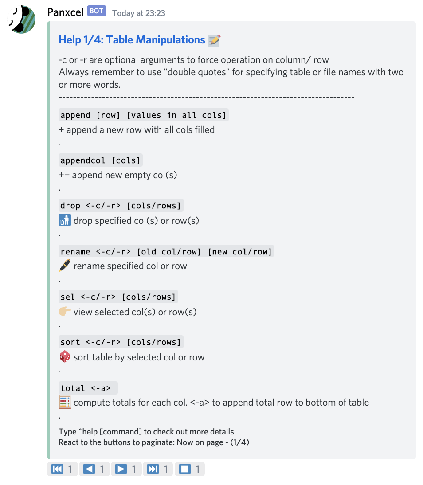
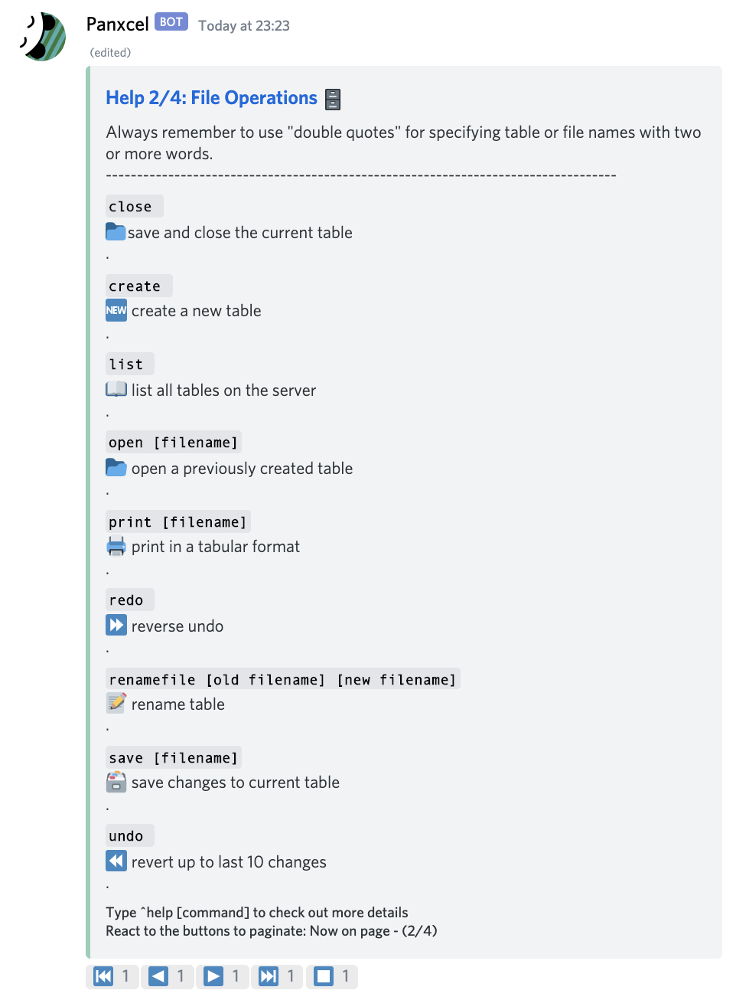
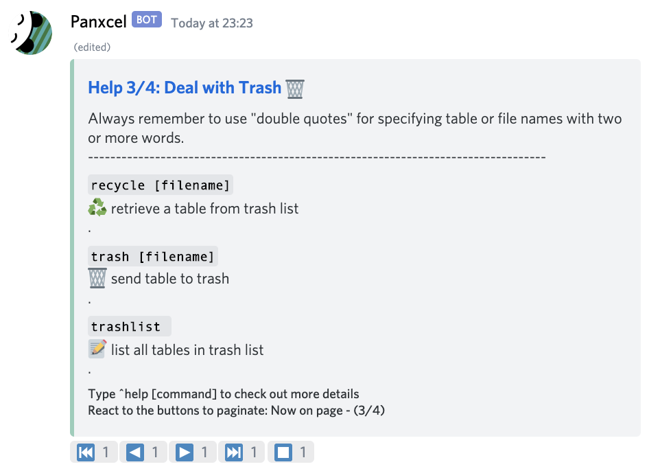
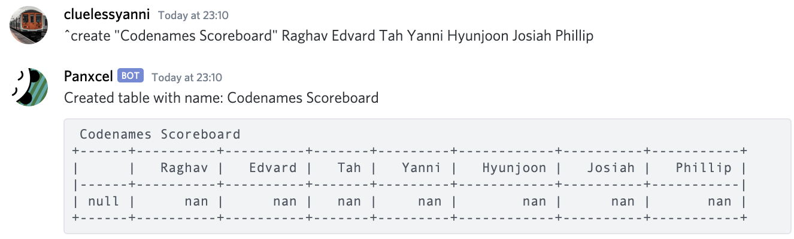
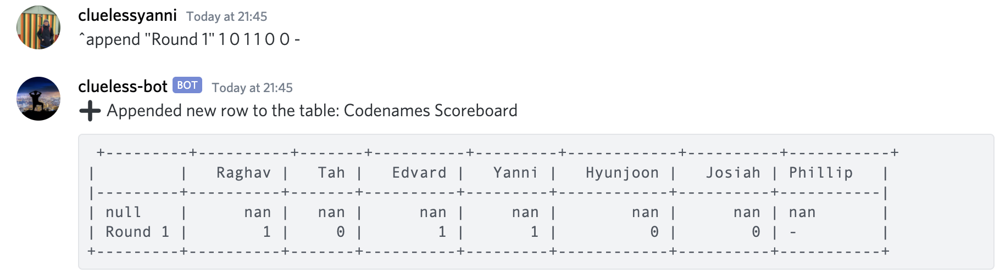
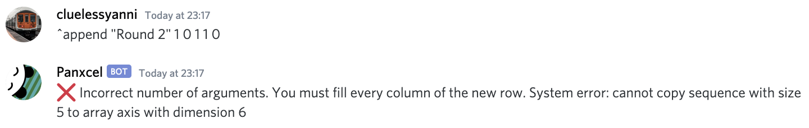
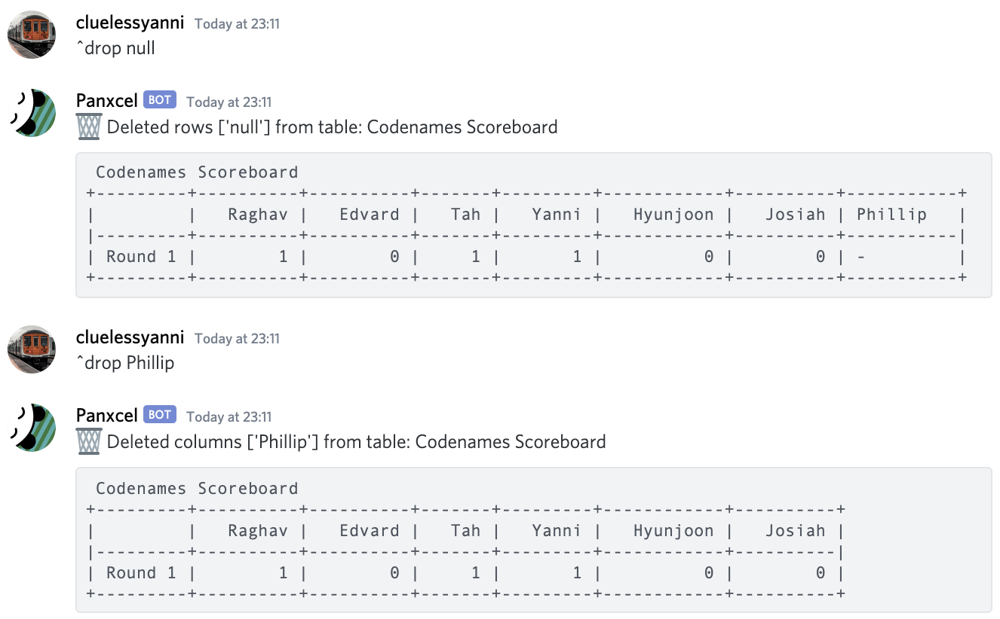
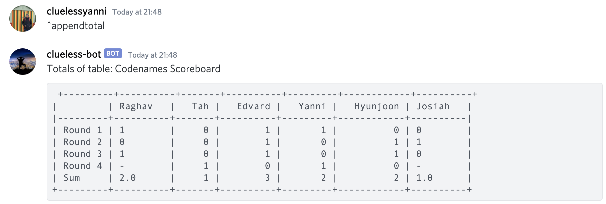
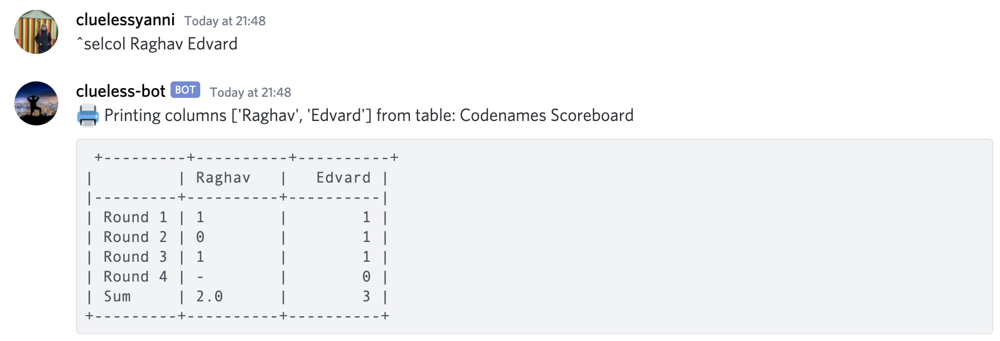

# Panxcel

Discord is far more than an online social networking tool. The platform allows developers to create a wide variety of bots, allowing them and to bring a range of interactive activities to users' chats, and inject a bit of life into an otherwise passive networking platform. Oddly, despite the widespread use of python for data science, very few python discord bot developers (or none, from observation) have attempted to create some some sort of discord bot that takes advantage of its python's beautifully simple data sciennce packages, such as Pandas.

This project is an attempt to wrap a couple "excel-like" functions into a python-scripted discord bot. At the moment it is relatively primitive, and it merely includes a couple file operation and column/row manipulation commands. At the moment, I can forsee it being a scoreboard tool on discord. Hopefully it will find its way into something more than this!

Why is the bot called "Panxcel" you say? Because the bot runs with Python's "Pandas" dataframes, and for most people using this bot, they will probably associate this with "Excel". And incidentally it sounds like ✏️ pencil. Hence the name "Panxcel"!

To invite Panxcel into your discord server, click [here](https://discord.com/oauth2/authorize?client_id=800745140733608006&scope=bot&permissions=2147483647).

## List of commands

This is a list of all commands available, which can be viewed upon calling `^help`.

  
   

  
   

## Quick walkthrough

First create a table, specifying the table name, as well as column names. If your table name is more than one word or if you intend to place more than on word within each cell, remember to place "double quotation marks".

Then start appending rows to the table!

When appending a new row, you must specify every single cell in the row. Otherwise, the entry is ambiguous, and the bot will return an error.

By default the bot generates a null row for demonstration. You can drop it, as well as other columns or rows you have added by mistake.

For scoreboard purposes, you can append the total of each column as a new row.

The `^sel` feature might be particularly useful for viewing a certain set of data, especially when you have many columns or rows in your table.

This is a non-exhaustive list of things you can do with this bot. To check out the many more features, have a look at all the commands listed upon calling `^help`.

## Roadmap/ Changelog

[x] Actually host the bot online, so that different servers can use the bot at the same time, and to ensure that the tables are not all jammed up on my local hard drive.

[x] Support multiple servers simultaneously.

[x] Support undo/redo - currently supports up to 10 undos.

[ ] Support for more row and column operations, as well as other methods of displaying the table.